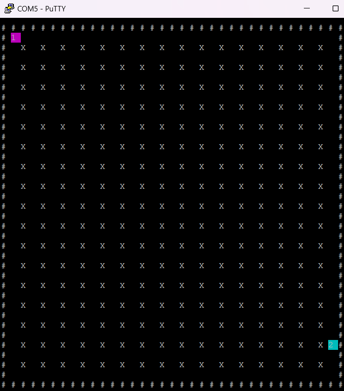

# Mbed Bomberman

[](https://github.com/ssferraz/mbed-bomberman/actions) 



## Application functionality

The "Mbed Bomberman" game is a simplified version of the classic Bomberman game, with the following rules:

- Two players compete in the game.
- Each player can only drop one bomb at a time.
- The board is fixed and must have a minimum size of 76x72.
- Player characters are 2x2 in size.
- The bombs are the same 2x2 size.
- When a bomb explodes, it creates an explosion that also has a rowxcolumn maximum.

## Building and running

1. Connect a USB cable between the USB port on the board and the host computer.
1. Run the following command to build the Bomberman project and program the microcontroller flash memory:

    ```bash
    $ git clone https://github.com/ssferraz/mbed-bomberman.git
    $ mbed deploy
    ```
    
Alternatively, you can manually copy the binary to the board, which you mount on the host computer over USB.

### Team members

- [@ssferraz](https://github.com/ssferraz) Samuel Ferraz
- [@otaviotrk](https://github.com/otaviotrk) Otávio
- [@jerickleandro](https://github.com/jerickleandro) Erick Leandro

### License and contributions

The software is provided under Apache-2.0 license. Contributions to this project are accepted under the same license. Please see [CONTRIBUTING.md](./CONTRIBUTING.md) for more info.

This project contains code from other projects. The original license text is included in those source files. They must comply with our license guide.
